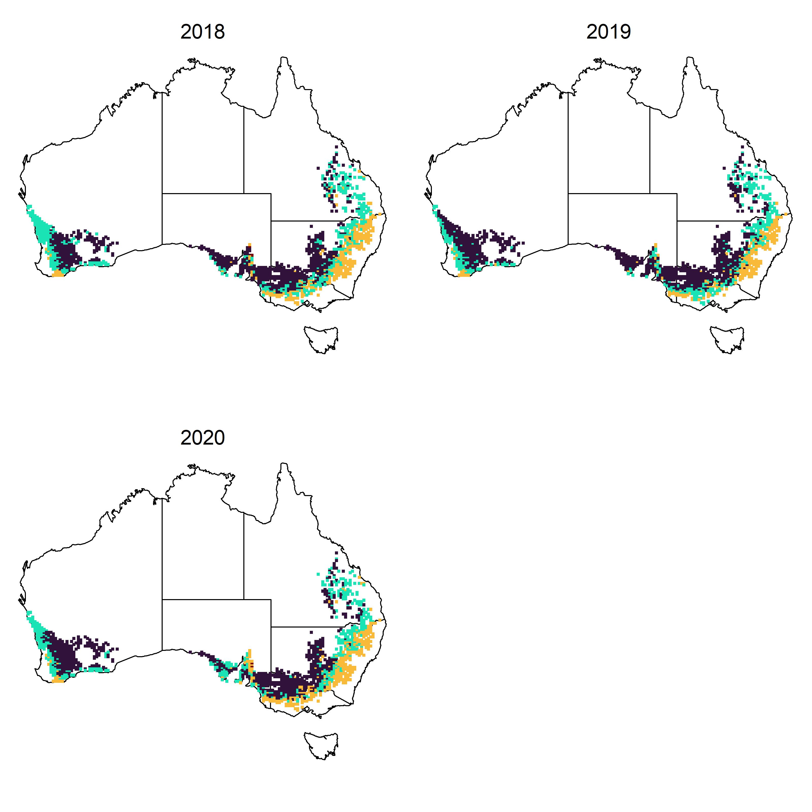

```{r, include = FALSE}
knitr::opts_chunk$set(
  fig.align = "center",
  collapse = TRUE,
  eval = FALSE,
  comment = "#>"
)
```

This vignette runs through an example workflow to derive Environmental Covariates (ECs) from weather and soil data for a multi-environment trial analysis using the example datasets included in the EC4MET package.

# Installing EC4MET

The EC4MET package can be installed from Github and loaded from your library. Built with R `getRversion()`.

```{r setup}
# devtools::install_github("NickFlagleaf/EC4MET", build_vignettes = T)
library(EC4MET)
```

# Example work flow

Load package and example dataset of info for field trial environments:

```{r load example data}
data("CAIGE20_22envs")
```

The example data set includes environment names, lat and lon values and sowing dates for 36 trial environments in Australia as part of the CAIGE project [@trethowan2024] as well as fitted environmental main effects and factor loadings fitted from a factor analytic mixed model multi-environment trial (MET) analysis as described by [@fradgley2025; @smith2021].

```{r Look at example data}
head(CAIGE20_22envs)
```

## Get ECs for observed environments

Get daily weather data from [SILO](https://www.longpaddock.qld.gov.au/silo/) [@jeffrey2001] for each observed environment in the MET with the `get.SILO.weather()` function:

```{r Get SILO weather data, message=FALSE, warning=FALSE}
obs.wthr <- get.SILO.weather(
  Envs = CAIGE20_22envs$Environment,
  Lats = CAIGE20_22envs$Lat,
  Lons = CAIGE20_22envs$Long,
  Years = CAIGE20_22envs$Year,
  verbose = T
)
```

The `get.BARRA.weather()` function can similarly be used to extract different weather data from the [BARRA-R2](https://opus.nci.org.au/spaces/NDP/pages/264241166/BOM+BARRA2+ob53) data resource [@su2022] and should output data in the same format.

You can see that the `$data` output from this contains a data matrix for each of six weather variables with the 36 environments as rows and 365 days of the year as columns:

```{r look at SILO weather}
sapply(obs.wthr$data, dim)
```

A daily index of soil moisture can also be estimated be calculated based on the rainfall, temp, and day length and added to the weather data object:

```{r Add SMI to SILO weather}
obs.wthr <- add.SMI(obs.wthr)
```

The weather data can then be used to define crop growth stage specific ECs for each environment.

```{r Calculate SILO ECs, message=FALSE, warning=FALSE}
obs.weather.ECs <- get.W.ECs(
  weather = obs.wthr,
  sow.dates = CAIGE20_22envs$Sowing.date,
  verbose = T
)
```

You can see that the output from this function includes (`ECs`) a data frame of 104 ECs as columns for 36 environments as rows as well as a data frame (`gs.dates`) of estimated dates of crop growth stages that the ECS were calculated between:

```{r Look at EC data}
dim(obs.weather.ECs$ECs)
head(obs.weather.ECs$gs.dates)
```

As well as weather related ECs, soil attribute covariates can be extracted using the `get.S.ECs` function from the [SLGA](https://www.clw.csiro.au/aclep/soilandlandscapegrid/GetData-R_package.html) data resource [@grundy2015]. The soil EC data matrix is also in the same format with 36 environments as rows and 96 soil ECS as columns

```{r Get SLGA ECs, message=FALSE, warning=FALSE}
obs.soil.ECs <- get.S.ECs(
  Envs = CAIGE20_22envs$Environment,
  Lats = CAIGE20_22envs$Lat,
  Lons = CAIGE20_22envs$Long,
  verbose = F
)
```

The soil EC data matrix is also in the same format with 36 environments as rows and 96 soil ECS as columns:

```{r Look at Soil EC dims}
dim(obs.soil.ECs)
```

For more information on how ECs are calculated, see @fradgley2025 .

## Get ECs for a wider set of unobserved environments

An example dataset of gridded environment locations that cover the extend of the Australian wheat belt is also included in the package. This dataset includes 5,091 unique environments between 2018 and 2020.

```{r load and look at wheat area envs dataset}
data("wheat.area.envs")
head(wheat.area.envs)
dim(wheat.area.envs)
unique(wheat.area.envs$Year)
```

ECs for all of these untested environments can be extracted and calculated in a similar way as for the observed data.

```{r Get soil and weather ECS for all wheat area envs, message=FALSE, warning=FALSE}
wheat.area.wthr <- get.SILO.weather(
  Envs = wheat.area.envs$Env,
  Lats = wheat.area.envs$Lat,
  Lons = wheat.area.envs$Lon,
  Years = wheat.area.envs$Year,
  verbose = T
)

wheat.area.wthr<-add.SMI(wheat.area.wthr)

wheat.area.wthr.ECs <- get.W.ECs(
  weather = wheat.area.wthr,
  sow.dates = wheat.area.envs$sow.dates,
  verbose = T
)

wheat.area.soil.ECs <- get.S.ECs(
  Envs = wheat.area.envs$Env,
  Lats = wheat.area.envs$Lat,
  Lons = wheat.area.envs$Lon,
  verbose = T
)
```

Combine weather and soil ECs for the observed and wheat belt environments:

```{r combine EC datas}
obsECs <- cbind(obs.weather.ECs$ECs, obs.soil.ECs)

wheat.area.ECs <- cbind(wheat.area.wthr.ECs$ECs, wheat.area.soil.ECs)
```

##Predict into unobserved environments

Predict environmental effects defibed in the observed environments dataset for all wheat belt environments based on the ECs using the `pred.env.effs()` function:

```{r predict env effects, message=FALSE, warning=FALSE}
obs.env.effs <- CAIGE20_22envs[, c("Main_E_effect", "FA1", "FA2", "FA3")]
rownames(obs.env.effs) <- CAIGE20_22envs$Environment
wheat.area.preds <- pred.env.effs(
  train.ECs = obsECs,
  new.ECs = wheat.area.ECs,
  E.effs = obs.env.effs
)
```

Environment type iClasses that are defined from the combination of either positive or negative factor loadings for each environment can be calculated as described by @smith2021. These iClass environement types can then be plotted for all environments in the Australian grain belt on maps for each year:

```{r Plot iClass maps, warning=FALSE, fig.align='center',fig.width=8,fig.height=8}
iclasses <- apply(wheat.area.preds[, c("FA1", "FA2", "FA3")], 1, function(x) paste(ifelse(x > 0, "p", "n"), collapse = ""))

iclass.cols <- c("#30123BFF", "#1AE4B6FF", "#FABA39FF", "#7A0403FF")
names(iclass.cols) <- unique(iclasses)
par(mfrow = c(2, 2), mar = c(1, 1, 1, 1))
for (y in unique(wheat.area.envs$Year)) {
  oz::oz()
  points(wheat.area.envs$Lon[wheat.area.envs$Year == y],
    wheat.area.envs$Lat[wheat.area.envs$Year == y],
    pch = 15, cex = .5,
    col = iclass.cols[iclasses[wheat.area.envs$Year == y]]
  )
  mtext(text = y, side = 3, line = -1.5, cex = 1.2)
}
```

{width="500"}

## References
